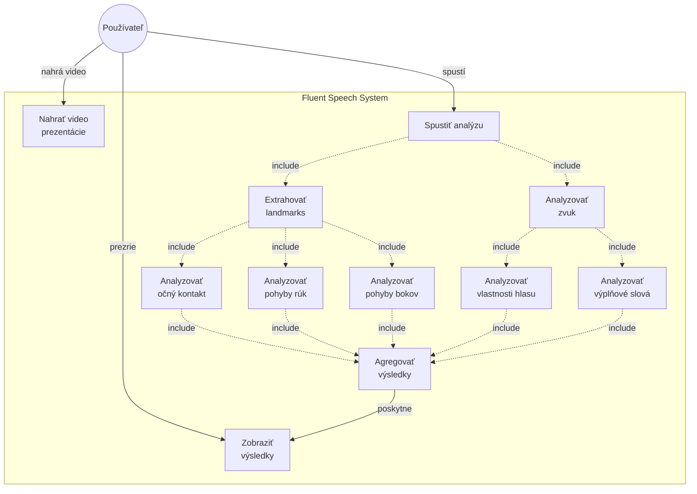
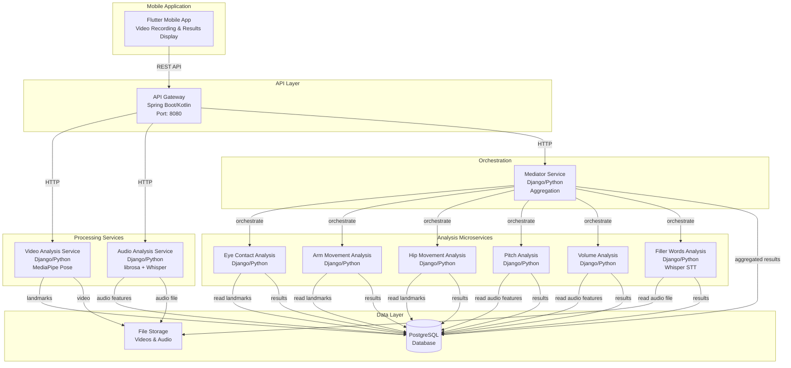
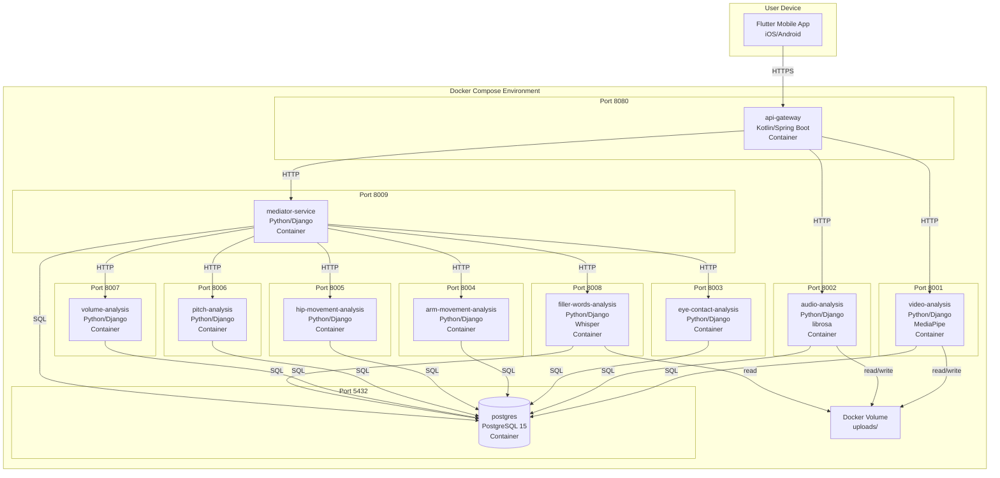
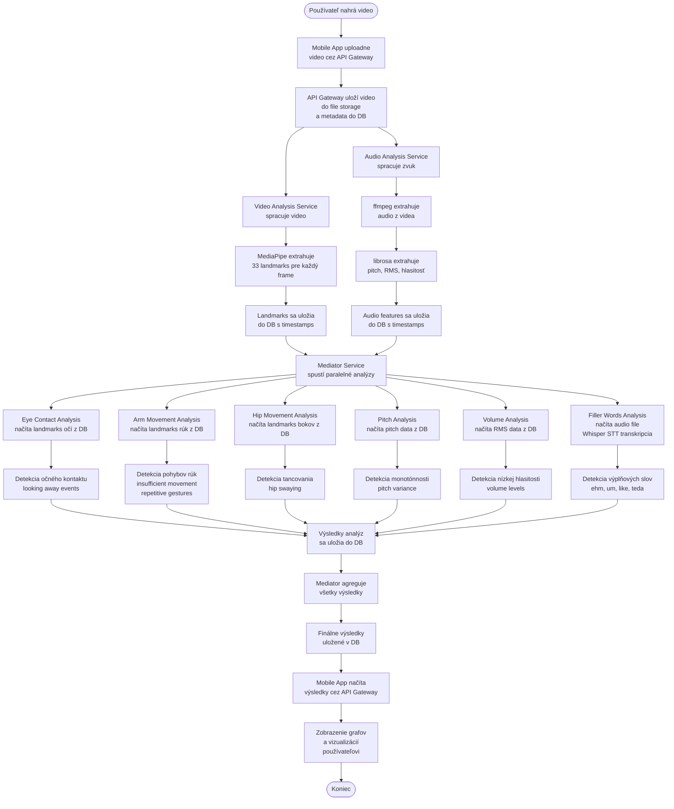
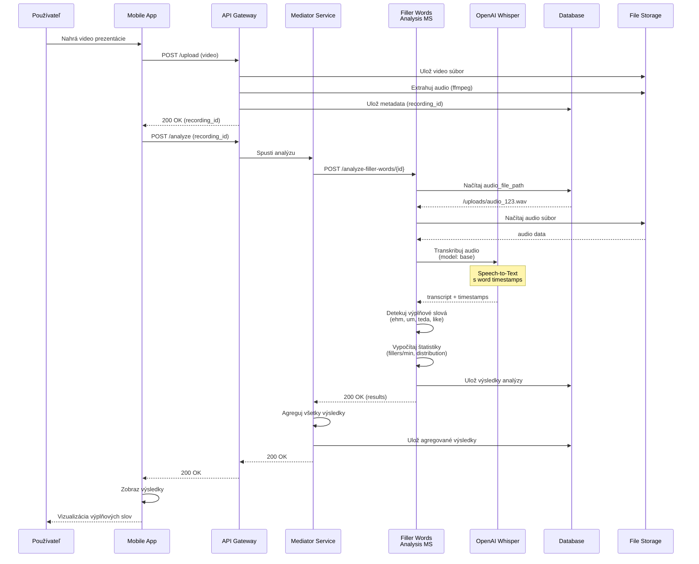

# Priebežná správa - Zoznam úloh a obsah (do 2. januára 2025)

## Aktuálny stav dokumentu

### ✅ ČO UŽ MÁŠ HOTOVÉ

#### 1. Formálne náležitosti
- ✅ Zadanie práce (project_description.tex)
- ✅ Anotácia v slovenčine (annotation.tex)
- ✅ Anotácia v angličtine (annotation.tex)
- ✅ Úvod (1uvod.tex)

#### 2. Analýza problematiky (2analyza.tex) - TAKMER HOTOVÉ
**Súčasný stav: Analýza vyzerá komplexne, ale skontroluj nasledovné:**

**Máš:**
- ✅ Význam prezentácie a účely prezentácií
- ✅ Prezentačné schopnosti - definícia
- ✅ Stavba komunikácie (pravidlo 7-38-55)
- ✅ Neverbálna komunikácia - tabuľka negatívnych javov
- ✅ Vlastnosti hlasu
- ✅ Verbálna komunikácia - výplňové slová
- ✅ Časové rady - segmentácia a detekcia trendu
- ✅ Spracovanie audio signálov (vzorkovanie, bitová hĺbka, normalizácia, extrakcia vlastností)
- ✅ Existujúce riešenia - MACH, ROC Speak, GestureLens
- ✅ Porovnanie riešení v tabulke

**Skontroluj/doplň:**
- [ ] **State-of-the-Art**: Prezri si, či si dostatočne pokryl súčasný stav poznania (2-3 ďalšie akademické články/štúdie okrem tých čo už máš)
- [ ] **Definícia problému**: Máš ju rozptýlenú po celej analýze - mohlo by sa zvýrazniť samostanou sekciou "Definícia problému" kde explicitne povieš: "Problémom je XYZ, preto je táto práca dôležitá"
- [ ] **Literatúra**: Skontroluj či citácie nie sú len z prednášok/skrípt - podľa mailu požadujú "preštudovanú literatúru (nielen informácie z prednášok)"

#### 3. Návrh riešenia (3navrh.tex) - HOTOVÉ ✅
**Súčasný stav: Návrh vyzerá veľmi dobre!**

**Máš:**
- ✅ Špecifikácia funkčných požiadaviek
- ✅ Prípady použitia (UC1, UC3, UC4) - detailne rozpísané
- ✅ Architektúra riešenia s diagramami (sekvenčné diagramy + celkový diagram)
- ✅ Použité technológie (Flutter, Django/Python, Spring Boot/Kotlin, MediaPipe, librosa, PostgreSQL, Docker)
- ✅ Zdôvodnenie voľby technológií

**Môžeš doplniť (nie nutné, ale pekné):**
- [ ] Jeden hlavný use case graficky zobrazený (UML use case diagram) - podľa mailu "aspon jeden ten hlavny, komplexny je potrebne graficky zobrazit"
- [ ] Ak máš viac use cases, môžeš ich vymenovat textovo (UC2: Trénovanie konkrétneho javu, UC5: Správa histórie)

---

### ⚠️ ČO URČITE MUSÍŠ DOPLNIŤ

#### 4. Implementácia (4implementacia.tex) - KRITICKÉ! ⚠️
**Súčasný stav: Veľmi málo obsahu - len 12 riadkov!**

**Čo tam teraz je:**
- Spracovanie zvuku > Normalizácia (stručne)
- Spracovanie zvuku > Vzorkovacia rýchlosť (stručne)
- Spracovanie zvuku > Bitová hĺbka (prázdne)

**ČO MUSÍŠ PRIDAŤ** (podľa požiadaviek z mailu):

##### a) Popis Implementácie
> "Detailný popis realizácie navrhnutého riešenia. Uveďte kľúčové implementačné detaily, algoritmy alebo dátové štruktúry, ktoré boli použité. Táto časť nie je kód, ale popis, ako bol kód vytvorený."

**Sekcie ktoré by si mal mať:**
- [ ] **Implementovaná funkcionalita** - čo už funguje?
  - Video Analysis Service (extrakcia landmarks pomocou MediaPipe)
  - Audio Analysis Service (extrakcia pitch, hlasitosti)
  - Eye Contact Analysis mikroslužba
  - Arm Movement Analysis mikroslužba
  - API Gateway
  - Mobilná aplikácia (ak niečo máš)

- [ ] **Spracovanie videa - extrakcia landmarks**
  - Ako funguje MediaPipe v tvojom riešení?
  - Ktoré landmarks používaš?
  - Ako ukladáš dáta (formát, databáza)?
  - Algoritmus/postup extrakcie

- [ ] **Spracovanie zvuku** (rozšír existujúci obsah)
  - Extrakcia zvukovej stopy (ffmpeg)
  - Normalizácia (dopíš)
  - Vzorkovacia rýchlosť (dopíš)
  - Bitová hĺbka (DOPÍŠ - teraz je prázdne!)
  - Extrakcia pitch (YIN algoritmus)
  - Extrakcia hlasitosti (RMS)

- [ ] **Implementácia detekcie očného kontaktu**
  - Ktoré landmarks používaš (oči)?
  - Ako počítaš viditeľnosť očí?
  - Aký algoritmus/logiku používaš?
  - Ako definuješ "dobrý" vs "zlý" očný kontakt?

- [ ] **Implementácia detekcie pohybov rúk**
  - Ktoré landmarks používaš (zápästia, lakte)?
  - Výpočet akcelerácie
  - Segmentácia časových radov - aký algoritmus?
  - Detekcia nedostatočnej gestikulácie
  - Detekcia opakujúcich sa gest

- [ ] **Implementácia analýzy hlasu**
  - Detekcia monotónnosti - ako počítaš variáciu pitch?
  - Detekcia nízkej hlasitosti - threshold?
  - Segmentácia - kde v reči sa mení vlastnosť?

- [ ] **Detekcia kritických bodov zmien** (change points)
  - Aký algoritmus používaš? (sliding window, bottom-up?)
  - Ako identifikuješ významné zmeny?

- [ ] **Dátové štruktúry**
  - Ako ukladáš landmarks (JSON, tabuľky)?
  - Ako ukladáš časové rady (audio features)?
  - Databázová schéma

##### b) Technické Detaily
> "Konfigurácia, nasadenie (deployment), použité knižnice a nástroje."

- [ ] **Nasadenie (Docker)**
  - Ako funguje docker-compose?
  - Ktoré services máš?
  - Komunikácia medzi kontajnermi

- [ ] **Použité knižnice**
  - Python: mediapipe, librosa, numpy, django, opencv
  - Kotlin: Spring Boot dependencies
  - Flutter: packages

- [ ] **Konfigurácia**
  - Databáza (PostgreSQL settings)
  - API endpoints
  - Limity (napr. max video size 500MB)

##### c) Testovanie a Overovanie
> "Popis použitých metód testovania (jednotkové testy, integračné testy, akceptačné testy). Prezentácia výsledkov testov preukazujúcich, že riešenie spĺňa definované požiadavky a ciele."

- [ ] **Testovanie funkcionality**
  - Testovacie videá - aké si používal?
  - Testovanie MediaPipe detekcie
  - Testovanie audio extrakcie
  - Testovanie jednotlivých mikroslužieb

- [ ] **Výsledky testov**
  - Funguje detekcia očného kontaktu? Aké sú výsledky?
  - Funguje detekcia pohybov rúk? Príklady
  - Funguje analýza hlasu? Príklady
  - Screenshots/grafy výsledkov

- [ ] **Jednotkové/Integračné testy** (ak máš)
  - Aké testy si napísal?
  - Výsledky (pass/fail)

##### d) Vyhodnotenie Riešenia
> "Kritické zhodnotenie dosiahnutých výsledkov vo vzťahu k pôvodným cieľom a požiadavkám. Potvrdenie (alebo vyvrátenie) predpokladov z analýzy."

- [ ] **Čo sa podarilo implementovať**
  - Ktoré funkčné požiadavky sú hotové?
  - Funguje detekcia očného kontaktu? ✅/❌
  - Funguje detekcia pohybov rúk? ✅/❌
  - Funguje analýza hlasu? ✅/❌
  - Funguje detekcia kritických bodov? ✅/❌

- [ ] **Problémy a výzvy**
  - S čím si mal problém počas implementácie?
  - Aké problémy si vyriešil? (podľa mailu: "V praci mozete spomenut aj problemy, ktore ste riesili")

- [ ] **Zhodnotenie voči pôvodným cieľom**
  - Splnil si to čo si plánoval v návrhu?
  - Čo sa zmenilo oproti návrhu?

##### e) Implementačná architektúra
> "implementacna architektura, t.j. architektura ktora popisuje, kde je riesenie hostovane, akym sposobom, aky programovaci jazyk, prostredie, kniznice, atd."

- [ ] **Diagram nasadenia**
  - Kde beží API Gateway? (Docker kontajner)
  - Kde bežia mikroslužby? (Docker kontajnery)
  - Kde je databáza? (PostgreSQL kontajner)
  - Ako komunikujú? (HTTP REST API)

- [ ] **Vývojové prostredie**
  - IDE (PyCharm, IntelliJ, VS Code?)
  - Nástroje (Docker, Git)

##### f) Tok spracovania dát (podľa mailu)
> "jasny postup napriklad spracovania dat, vo forme tabuliek a grafov"

- [ ] **Diagram/Graf toku spracovania**
  - Video upload → Video Analysis → Landmark extraction → Analysis mikroslužby → Výsledky
  - Môže byť flowchart alebo sekvenčný diagram

---

#### 5. Harmonogram práce (appendices/plan.tex) - AKTUALIZUJ
**Súčasný stav: Máš plán pre všetky 3 semestre, ale potrebuješ "harmonogram prace na dalsi semester"**

**ČO TREBA:**
- [ ] Zaktualizuj plán pre **Letný semester DP3** aby bol detailnejší
- [ ] Uvedz konkrétne úlohy ktoré ešte zostávajú:
  - Dokončenie mikroslužieb (Hip Movement Analysis?)
  - Implementácia mobilnej aplikácie (vizualizácie)
  - Implementácia Mediator Service
  - Detekcia výplňových slov (Speech-to-Text?)
  - Testovanie na reálnych používateľoch
  - Optimalizácia algoritmov
  - Finalizácia dokumentácie

**Príklad:**
```
\section{Letný semester DP3}
\begin{itemize}
    \item 1-2 týždeň - Dokončenie Hip Movement Analysis mikroslužby
    \item 3-5 týždeň - Implementácia mobilnej aplikácie (Flutter UI, vizualizácie)
    \item 6-7 týždeň - Implementácia detekcie výplňových slov (integrácia Speech-to-Text)
    \item 8-9 týždeň - Testovanie na reálnych používateľoch a zber spätnej väzby
    \item 10-11 týždeň - Optimalizácia algoritmov a oprava chýb
    \item 12-13 týždeň - Finalizácia dokumentácie a príprava na obhajobu
\end{itemize}
```

---

## DODATOČNÉ POŽIADAVKY Z MAILU

### Obrazový materiál (SKONTROLUJ)
Podľa mailu požadujú:

1. **Architektúra riešenia** ✅
   - Máš diagram v 3navrh.tex ✅

2. **Use Case diagram - graficky aspoň jeden hlavný** ⚠️
   - Teraz máš len textový popis UC1, UC3, UC4
   - [ ] Vytvor UML Use Case diagram pre UC3 (Celková analýza) - je najkomplexnejší
   - Príklad: Actor (Používateľ), Use Cases (Nahrať video, Spustiť analýzu, Zobraziť výsledky, atď.)

3. **Tok spracovania dát - tabuľky/grafy** ⚠️
   - [ ] Vytvor flowchart alebo diagram toku dát
   - Príklad: Video → MediaPipe → Landmarks → Eye Contact Analysis → Výsledky

### Rozsah
- Mail hovorí: **20-40 strán**
- Teraz asi máš ~15-20 strán (odhadom)
- Po doplnení implementačnej časti by si mal byť v tomto rozsahu

---

## PRIORITIZOVANÝ CHECKLIST PRE TEBA

### KRITICKÉ (musíš mať do 2.1.)
1. [ ] **Doplň kapitolu Implementácia** - toto je najviac kritické!
   - Popis implementovaných mikroslužieb
   - Spracovanie videa (MediaPipe)
   - Spracovanie zvuku (dopíš bitovú hĺbku!)
   - Detekcia očného kontaktu
   - Detekcia pohybov rúk
   - Dátové štruktúry

2. [ ] **Testovanie a výsledky**
   - Opíš ako si testoval
   - Ukáž výsledky (grafy, screenshots)

3. [ ] **Vyhodnotenie riešenia**
   - Čo funguje, čo nie
   - Problémy ktoré si riešil

4. [ ] **Aktualizuj harmonogram** pre letný semester DP3

### DÔLEŽITÉ (mali by si mať)
5. [ ] **Use Case diagram** - aspoň jeden grafický (UML)
6. [ ] **Tok spracovania dát** - flowchart/diagram
7. [ ] **Implementačná architektúra** - diagram nasadenia

### SKONTROLUJ (môže počkať na zajtra)
8. [ ] Analýza - skontroluj State-of-the-Art (2-3 ďalšie zdroje)
9. [ ] Analýza - pridaj explicitnú sekciu "Definícia problému"
10. [ ] Skontroluj citácie - nie len prednášky

---

## ODPORÚČANIA

1. **Zameraj sa hlavne na kapitolu Implementácia** - to je najväčší deficit
2. **Nemusíš písať všetko do detailu** - práca má byť 20-40 strán, nie 100
3. **Používaj obrázky/diagramy** - "one picture is worth a thousand words"
4. **Spomeň problémy** - podľa mailu to oceňujú: "V praci mozete spomenut aj problemy, ktore ste riesili"
5. **Buď konkrétny** - namiesto "implementoval som detekciu" napíš "implementoval som detekciu očného kontaktu pomocou landmarks 468-473, kde počítam viditeľnosť pomocou confidence score..."

---

## ŠTRUKTÚRA KTORÚ BY SI MAL MAŤ (finálna)

```
1. Úvod ✅
2. Analýza problematiky ✅ (možno drobné úpravy)
   2.1 Význam prezentácie ✅
   2.2 Prezentačné schopnosti ✅
   2.3 Stavba komunikácie ✅
   2.4 Časové rady ✅
   2.5 Spracovanie audio signálov ✅
   2.6 Existujúce riešenia ✅
3. Návrh riešenia ✅
   3.1 Špecifikácia požiadaviek ✅
   3.2 Prípady použitia ✅ (+ pridať UML diagram)
   3.3 Architektúra riešenia ✅
   3.4 Použité technológie ✅
4. Implementácia riešenia ⚠️ DOPÍŠ!
   4.1 Spracovanie videa (MediaPipe extrakcia)
   4.2 Spracovanie zvuku (dopíš bitovú hĺbku)
   4.3 Detekcia očného kontaktu
   4.4 Detekcia pohybov rúk
   4.5 Analýza hlasu
   4.6 Dátové štruktúry a databáza
   4.7 Nasadenie (Docker)
   4.8 Testovanie
   4.9 Vyhodnotenie riešenia
5. Záver (možno stručný pre priebežnú správu)
Prílohy:
   A. Harmonogram práce ✅ (aktualizuj DP3)
Bibliografia ✅
```

---

Poznámka: Toto je len moja sumarizácia podľa toho čo som našiel v dokumentoch a podľa požiadaviek z mailu. Zajtra sa k tomu môžeš vrátiť a rozhodnúť čo konkrétne doplníš.

---

# MERMAID DIAGRAMY PRE DOKUMENTÁCIU

## 1. Use Case Diagram - Celková analýza prezentácie



## 2. Component Diagram - Architektúra systému



## 3. Deployment Diagram - Docker Compose Environment



## 4. Data Flow Diagram - Celkový tok spracovania



## 5. Sequence Diagram - Whisper Filler Words Analysis



---

## Použitie diagramov v LaTeX

Pre LaTeX dokument môžeš tieto Mermaid diagramy:
1. Exportovať ako PNG pomocou Mermaid Live Editor (https://mermaid.live)
2. Alebo použiť `mermaid-cli` pre automatickú konverziu
3. Vložiť do dokumentu pomocou `\includegraphics`

Príklad:
```latex
\begin{figure}[H]
\centering
\includegraphics[width=\textwidth]{assets/images/use_case_diagram.png}
\caption{Use Case diagram - Celková analýza prezentácie}
\label{fig:usecase}
\end{figure}
```
