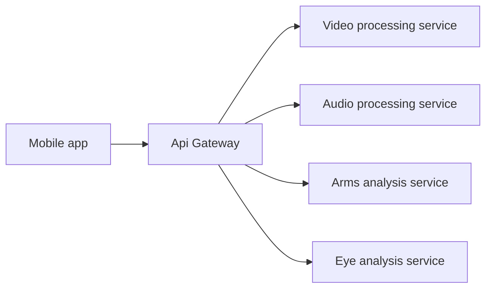
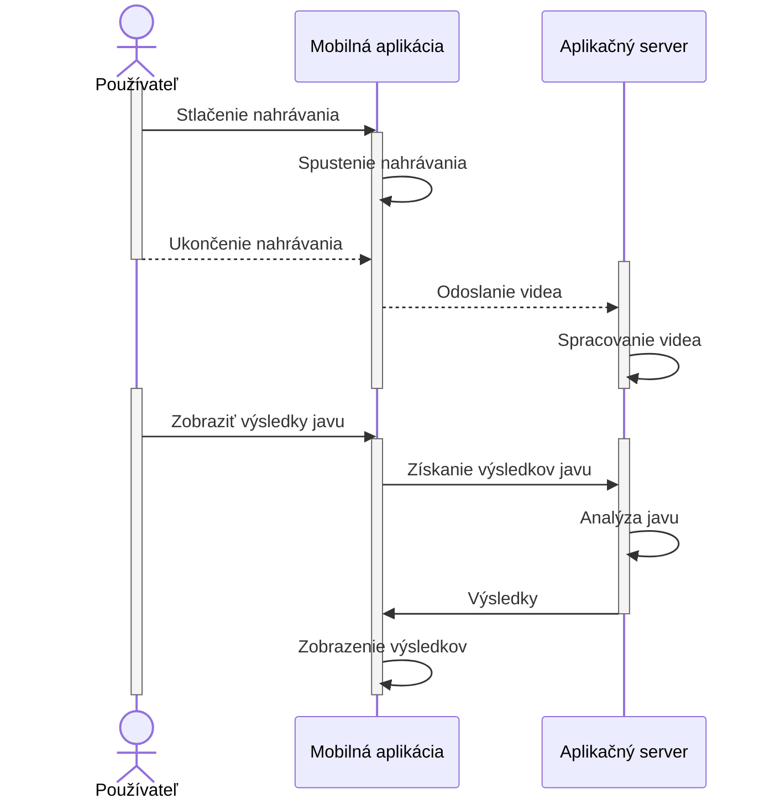

-# Which services communicate with each other?

```mermaid
flowchart LR
    App[Mobile app]
    ApiGW[Api Gateway]
    VideoService[Video processing service]
    AudioService[Audio processing service]
    ArmsService[Arms analysis service]
    EyeService[Eye analysis service]
    App --> ApiGW
    ApiGW --> VideoService
    ApiGW --> AudioService
    ApiGW --> ArmsService
    ApiGW --> EyeService
```

# Basic flow of the software

```mermaid
sequenceDiagram
    actor Používateľ
    activate Používateľ
    Používateľ->>Mobilná aplikácia: Stlačenie nahrávania
    activate Mobilná aplikácia
    Mobilná aplikácia->>Mobilná aplikácia: Spustenie nahrávania
    Používateľ-->>Mobilná aplikácia: Ukončenie nahrávania
    deactivate Používateľ
    activate Aplikačný server
    Mobilná aplikácia-->>Aplikačný server: Odoslanie videa
    Aplikačný server->>Aplikačný server: Spracovanie videa
    deactivate Aplikačný server
    deactivate Mobilná aplikácia
    activate Používateľ
    Používateľ->>Mobilná aplikácia: Zobraziť výsledky javu
    activate Mobilná aplikácia
    activate Aplikačný server
    Mobilná aplikácia->>Aplikačný server: Získanie výsledkov javu
    Aplikačný server->>Aplikačný server: Analýza javu
    Aplikačný server->>Mobilná aplikácia: Výsledky
    deactivate Aplikačný server
    Mobilná aplikácia->>Mobilná aplikácia: Zobrazenie výsledkov
    deactivate Mobilná aplikácia
    deactivate Používateľ
```