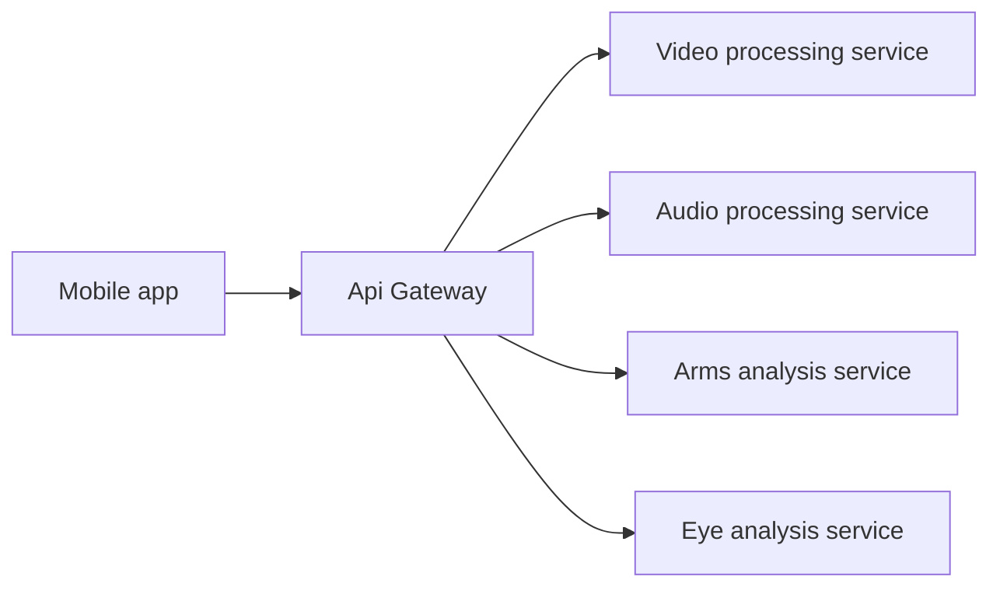

# Which services communicate with each other?

```mermaid
flowchart LR
    App[Mobile app]
    ApiGW[Api Gateway]
    VideoService[Video processing service]
    AudioService[Audio processing service]
    ArmsService[Arms analysis service]
    EyeService[Eye analysis service]
    App --> ApiGW
    ApiGW --> VideoService
    ApiGW --> AudioService
    ApiGW --> ArmsService
    ApiGW --> EyeService
```