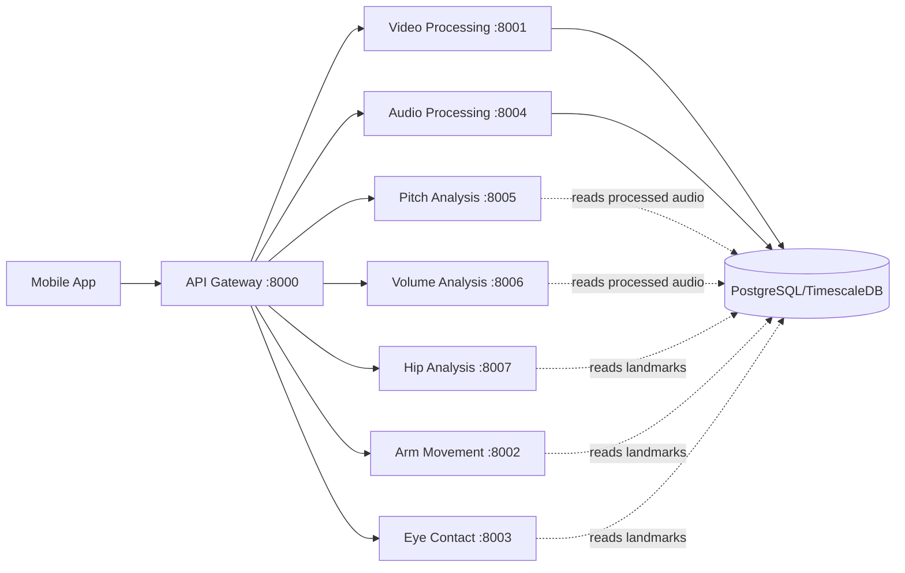
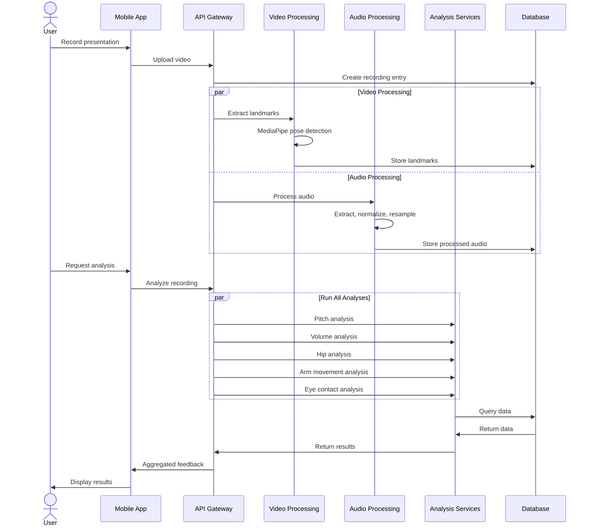

# Fluent Speech - Presentation Analysis System

An AI-powered system for analyzing and providing feedback on presentation skills through video and audio analysis.

## Overview

Fluent Speech is a microservices-based platform that analyzes presentation videos to provide comprehensive feedback on:
- **Voice Quality**: Pitch variation, volume dynamics, speaking pace
- **Body Language**: Gestures, posture, movement patterns, eye contact
- **Overall Delivery**: Confidence indicators, engagement metrics

## Architecture

### Microservices

| Service | Port | Purpose |
|---------|------|---------|
| **API Gateway** | 8000 | Main entry point, routes requests to microservices |
| **Video Processing** | 8001 | Extracts pose landmarks using MediaPipe |
| **Audio Processing** | 8004 | Extracts and preprocesses audio from video |
| **Pitch Analysis** | 8005 | Analyzes vocal pitch and monotony |
| **Volume Analysis** | 8006 | Analyzes volume levels and dynamics |
| **Hip Analysis** | 8007 | Analyzes body stability and posture |
| **Arm Movement Analysis** | 8002 | Analyzes gestures and arm kinematics |
| **Eye Contact Analysis** | 8003 | Analyzes gaze patterns and eye contact |

### Service Communication



### Data Flow



## Quick Start

### Prerequisites

- Python 3.11+
- PostgreSQL with TimescaleDB extension
- FFmpeg (for audio extraction)
- Docker & Docker Compose (optional)

### Setup with Docker Compose

1. Clone the repository:
```bash
git clone <repository-url>
cd fluent_speech
```

2. Configure environment variables:
```bash
cp .env.example .env
# Edit .env with your configuration
```

3. Start all services:
```bash
docker-compose up -d
```

4. Verify services are running:
```bash
docker-compose ps
```

5. Test the health endpoints (see `requests.http`)

### Manual Setup

Each microservice can be run independently. See individual README files in each service directory for detailed setup instructions.

## API Endpoints

See `requests.http` for example requests.

### Video Upload
```
POST http://localhost:8000/api/v1/videos/upload
```

### Processing Endpoints
```
POST http://localhost:8001/api/v1/video/{recording_id}/analyze/
POST http://localhost:8004/api/v1/audio/{recording_id}/process/
```

### Analysis Endpoints
```
POST http://localhost:8005/api/v1/pitch/{recording_id}/analyze/
POST http://localhost:8006/api/v1/volume/{recording_id}/analyze/
POST http://localhost:8007/api/v1/hip/{recording_id}/analyze/
POST http://localhost:8002/api/v1/analyze/arm-movements/{recording_id}/
POST http://localhost:8003/api/v1/analyze/eye-contact/{recording_id}/
```

## Development

### Project Structure

```
fluent_speech/
├── FluentApiGateway/          # API Gateway service
├── video_processing_ms/        # Video processing with MediaPipe
├── audio_processing_ms/        # Audio extraction and preprocessing
├── pitch_analysis_ms/          # Pitch analysis
├── volume_analysis_ms/         # Volume analysis
├── hip_analysis_ms/            # Hip movement analysis
├── arm_movement_analysis_ms/   # Arm gesture analysis
├── eye_contact_analysis_ms/    # Eye contact analysis
├── fluent/                     # Flutter mobile app
├── init-db.sql                 # Database initialization
├── docker-compose.yml          # Docker orchestration
├── requests.http               # API testing requests
└── README.md                   # This file
```

### Database Schema

See `init-db.sql` for the complete database schema.

**Key tables:**
- `recording`: Video metadata
- `frame_data`: Frame timestamps and indices
- `landmark`: Pose landmarks (x, y, z, visibility)
- `audio_features`: Audio analysis data (pitch, volume)

## Documentation

Each microservice has its own detailed README:
- [Audio Processing](./audio_processing_ms/README.md)
- [Pitch Analysis](./pitch_analysis_ms/README.md)
- [Volume Analysis](./volume_analysis_ms/README.md)
- [Hip Analysis](./hip_analysis_ms/README.md)
- [Arm Movement Analysis](./arm_movement_analysis_ms/README.md)
- [Eye Contact Analysis](./eye_contact_analysis_ms/README.md)
- [Video Processing](./video_processing_ms/README.md)

---

## TODO: Missing/Unimplemented Features

### High Priority

#### Audio Processing
- [ ] **Noise Reduction** - Implement audio noise reduction to clean up background sounds
  - Location: `audio_processing_ms/analysis_api/services.py:122`
  - Use noisereduce library or spectral gating
  - Apply before saving processed audio

#### Database Integration
- [ ] **Pitch Data Storage** - Save pitch analysis results to database
  - Location: `pitch_analysis_ms/pitch_api/services.py:117`
  - Create table for pitch features (timestamp, pitch_hz, voiced/unvoiced)
  - Enable historical analysis and comparisons

- [ ] **Volume Data Storage** - Save volume analysis results to database
  - Location: `volume_analysis_ms/volume_api/services.py:117`
  - Create table for volume features (timestamp, rms_energy)
  - Enable trend analysis over time

#### Data Aggregation
- [ ] **Frame-Level Aggregation** - Implement aggregation instead of frame-by-frame storage
  - Current issue: 20 records/second creates database bloat
  - Solution: Aggregate to 1-second windows with statistics (mean, std, min, max)
  - Affects: pitch_analysis_ms, volume_analysis_ms
  - Benefits: 95% storage reduction, faster queries

### Medium Priority

#### Analysis Features
- [ ] **Speaking Rate Analysis** - Detect words per minute and pacing
  - Requires: Speech-to-text integration
  - Microservice: New `speech_analysis_ms`
  - Metrics: WPM, pauses, filler words

- [ ] **Posture Analysis** - Full body posture assessment
  - Use existing landmarks from video_processing_ms
  - Analyze: Shoulder alignment, spine angle, head tilt
  - Microservice: New `posture_analysis_ms`

- [ ] **Gesture Recognition** - Classify specific gesture types
  - Extend arm_movement_analysis_ms
  - Detect: Pointing, waving, open palms, etc.
  - Use ML model or rule-based classification

#### Feedback Generation
- [ ] **Automated Feedback System** - Generate natural language feedback
  - Aggregate all analysis results
  - Identify strengths and weaknesses
  - Provide actionable recommendations
  - Microservice: New `feedback_generation_ms`

- [ ] **Scoring System** - Numerical scores for presentation quality
  - Score categories: Voice, body language, engagement
  - Overall presentation score (0-100)
  - Comparison against benchmarks

### Low Priority

#### Real-Time Features
- [ ] **Live Analysis** - Real-time feedback during presentation
  - Requires: Streaming architecture
  - WebSocket communication
  - Incremental analysis

- [ ] **Practice Mode** - Interactive practice with instant feedback
  - Real-time alerts for issues
  - Progressive improvement tracking

#### Advanced Analysis
- [ ] **Emotion Detection** - Identify emotional states from voice/face
  - Voice: Pitch patterns, energy
  - Face: Facial landmarks analysis
  - Combine for confidence scoring

- [ ] **Audience Engagement Prediction** - ML model for engagement scoring
  - Train on successful presentations
  - Predict audience retention
  - Suggest improvements

- [ ] **Multi-Speaker Support** - Handle multiple presenters
  - Speaker diarization
  - Individual analysis per speaker
  - Group presentation dynamics

#### Infrastructure
- [ ] **Async Processing** - Background job queue for analysis
  - Current: Synchronous HTTP requests
  - Future: Celery/RabbitMQ for async processing
  - Benefits: Faster response, better scalability

- [ ] **Caching Layer** - Cache analysis results
  - Redis for frequently accessed data
  - Reduce database load
  - Faster repeated queries

- [ ] **API Rate Limiting** - Prevent abuse and manage load
  - Implement in API Gateway
  - Per-user/per-IP limits
  - Graceful degradation

#### Mobile App
- [ ] **Video Preview** - Show processed video with overlays
  - Display pose skeleton
  - Highlight detected issues
  - Interactive timeline

- [ ] **Progress Tracking** - Historical improvement metrics
  - Track scores over time
  - Show improvement trends
  - Achievement system

- [ ] **Offline Mode** - Record and queue for later upload
  - Local storage
  - Background sync when online

### Technical Debt

- [ ] **Error Handling** - Comprehensive error handling across services
  - Standardize error responses
  - Proper HTTP status codes
  - Logging and monitoring

- [ ] **Testing** - Unit and integration tests
  - pytest for all services
  - Mock external dependencies
  - CI/CD pipeline

- [ ] **Documentation** - API documentation
  - OpenAPI/Swagger specs
  - Interactive API explorer
  - Request/response examples

- [ ] **Monitoring** - Service health monitoring
  - Prometheus metrics
  - Grafana dashboards
  - Alert system

---

## Contributing

Contributions are welcome! Please read the contributing guidelines before submitting PRs.

## License

[Your License Here]